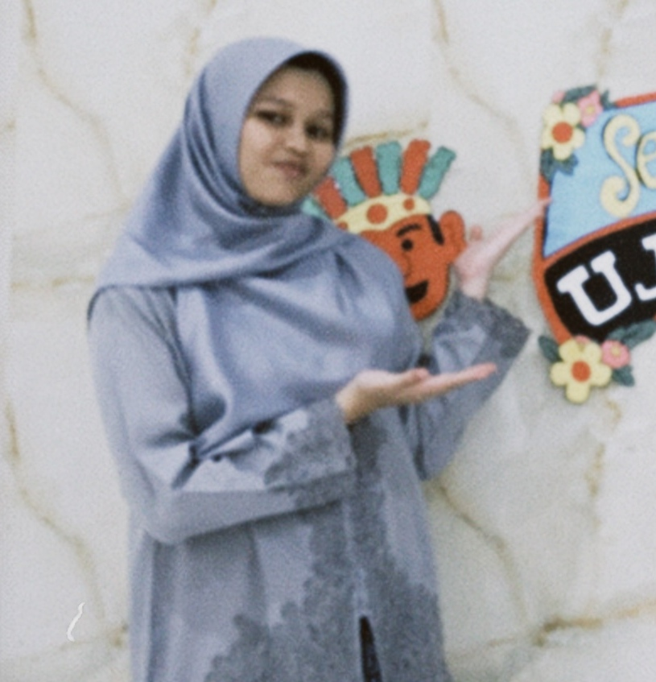

<!-- Banner / Header -->

  

<h1 align="center">🌸✨ Hi, I'm Rifqa Alifia Nurmadina ✨🌸</h1>

  <i>💻 Digital Explorer | 🎨 Creative Designer | 🐾 Cartoon Cat Enthusiast</i>

  
  

---

##  About Me  
Hi! I'm Rifqa 👋  
- 💻 Passionate about **Web & App Design, UI/UX, Conflict Mediation, E-learning, Travelling & Art**  
- 🌱 Always curious to learn new IT skills  
- 🌸 Loves connecting with people and making friends  
- 🐾 Cartoon cats are my happy energy ✨  

📸 Instagram: [@qa._lifiaan](https://instagram.com/qa._lifiaan)  

---

##  Tech Stack

  

---

##  GitHub Stats & Activity

  

  

  

---

##  Achievements & Trophies

  

---

##  Activity Graph

  

---

##  Featured Projects 🐾

  
  

---

##  Visitor Counter 😺

  

---

##  Cat Animation

  

---

##  Random Cat Fact

  <!--START_CAT_FACT-->
  Loading a new cat fact... 🐾
  <!--END_CAT_FACT-->

---

  

🌸✨ *“Designing with passion, coding with purpose, living with curiosity.”* ✨🌸  
